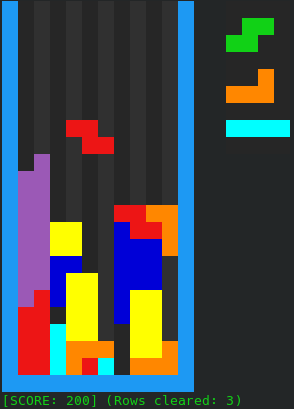

# Tetris
My complete and lightweight Tetris implementation based on SRS guidelines found [here](https://tetris.fandom.com/wiki/SRS). It works in terminal and is GNU/Linux only, with no plans to make a Windows/OSX version.
## Running
Unless `USE_CONFIGURATION_SPECIFIC_QOL_FEATURES` toggle is modified to 0 you will need to have `mpv` player installed and use X.Org server. To start run `./build run-release`.

