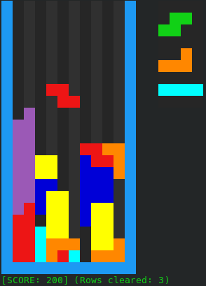

# Tetris
My complete and lightweight Tetris implementation based on SRS guidelines found [here](https://tetris.fandom.com/wiki/SRS). It works in terminal and is GNU/Linux only, with no plans to make a Windows/OSX version.  

